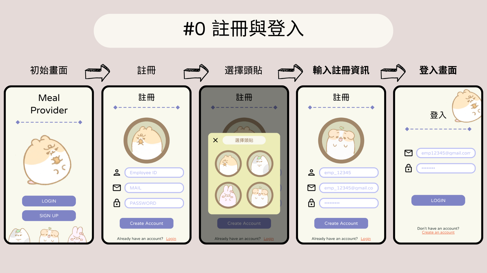
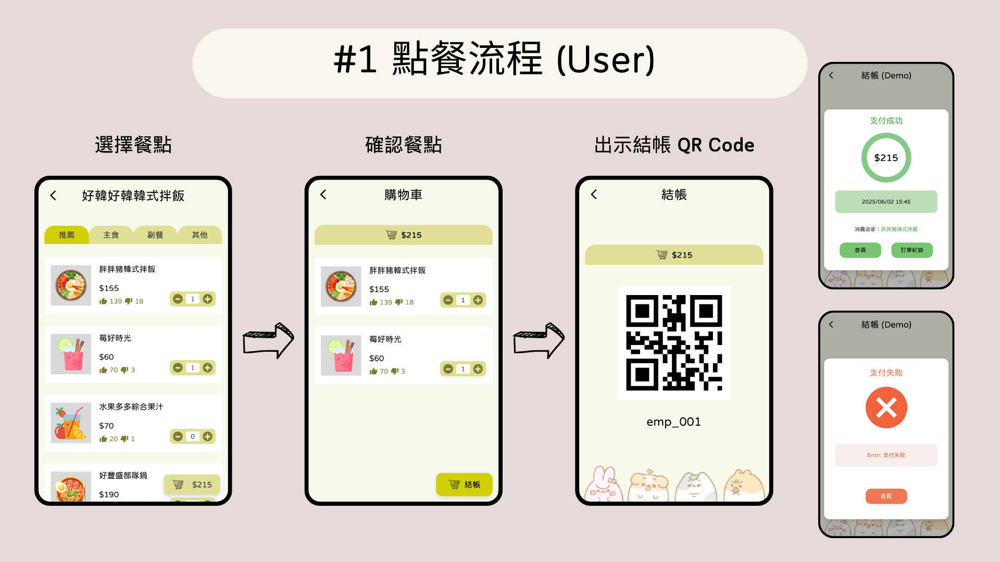
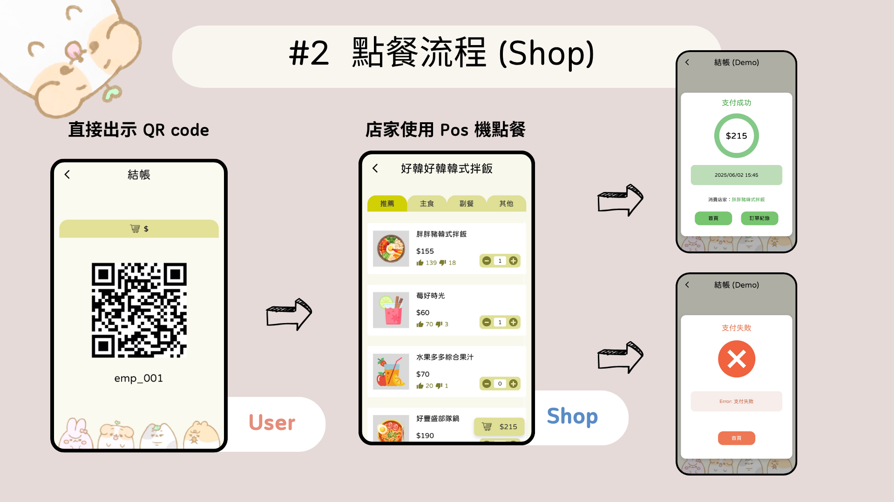

# Meal Provider
**NYCU 2025 - Cloud Native Development and Best Practice**

## Flow Diagrams
### Report: [MealProvider](docs/MealProvider_Group21.pdf)
  
  
  
  


## Getting Started with Create React App

This project was bootstrapped with [Create React App](https://github.com/facebook/create-react-app).

## Available Scripts

In the project directory, you can run:

### `npm start`

Runs the app in development mode.  
Open [http://localhost:3000](http://localhost:3000) to view it in your browser.

The page will reload when you make changes.  
You may also see any lint errors in the console.

**Remember to download backend code in here: [meal-provider-backend](https://github.com/ting0602/meal-provider-backend)**

### `npm run test`

Runs the unit tests in watch mode using Vitest.  
> **Note:** Only `npm run test` is supported; there is no `npm test`, `npm run test:unit`, or `npm run test:ci` in this project.

### `npm run build`

Builds the app for production to the `build` folder.  
It correctly bundles React in production mode and optimizes the build for the best performance.

The build is minified and the filenames include hashes.  
Your app is ready to be deployed!

See the section about [deployment](https://facebook.github.io/create-react-app/docs/deployment) for more information.

### `npm run eject`

> **Warning:** This is a one-way operation. Once you `eject`, you can’t go back!

If you aren’t satisfied with the build tool and configuration choices, you can `eject` at any time. This command will remove the single build dependency from your project.

Instead, it will copy all the configuration files and the transitive dependencies (Webpack, Babel, ESLint, etc.) right into your project so you have full control over them. All of the commands except `eject` will still work, but they will point to the copied scripts so you can tweak them. At that point, you are on your own.

You don’t have to ever use `eject`. The curated feature set is suitable for small and medium deployments, and you shouldn’t feel obligated to use this feature.

## Email Notification Feature (AdminPage)

If you want to enable the email notification functionality on the AdminPage, you need to create a `.env` file in the root of your project and add the following environment variables. These values are masked here; you must replace each masked entry with your own values obtained from [EmailJS](https://www.emailjs.com):
```
# .env
REACT_APP_EMAILJS_SERVICE_ID=service_xxx
REACT_APP_EMAILJS_TEMPLATE_ID=template_xxx
REACT_APP_EMAILJS_USER_ID=xxxxxxxxxx
```

